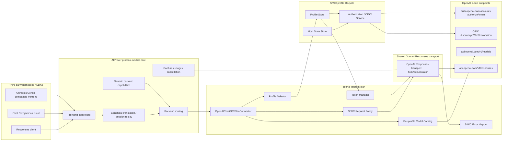
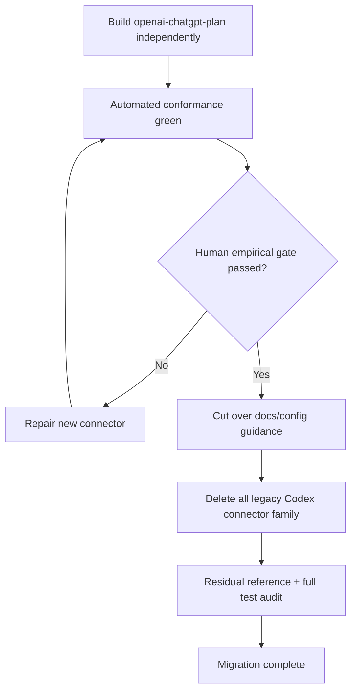
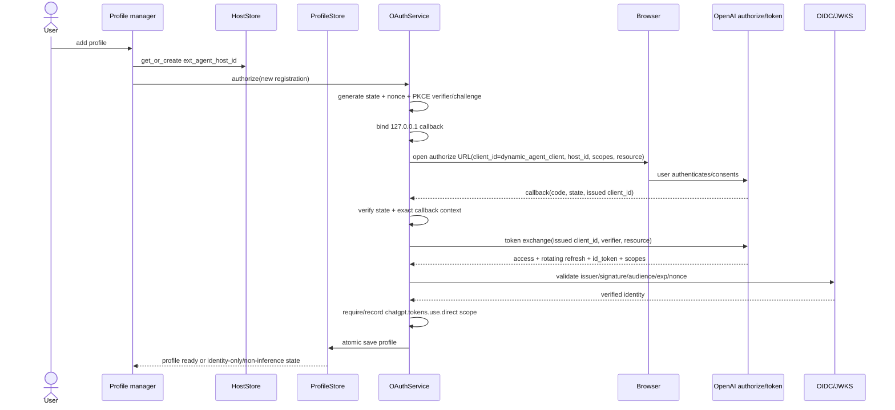
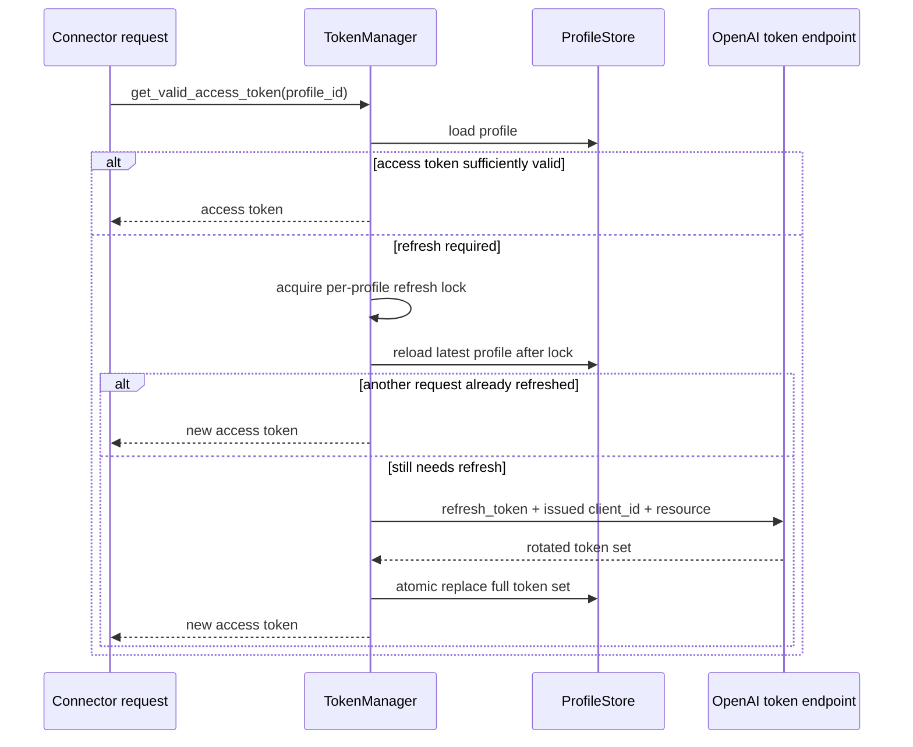
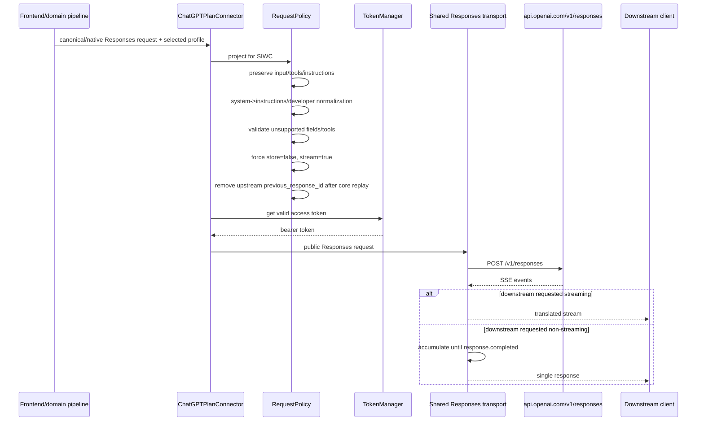

# Design Document

---
**Purpose**: Define an implementation-ready brownfield architecture for introducing the official ChatGPT-plan backend, proving it against real service behavior, cutting over, and deleting the complete legacy Codex connector family in one migration.
---

## Overview

This feature replaces AIProxer's private Codex-compatible ChatGPT-subscription integration with a new first-party backend, `openai-chatgpt-plan`, built around OpenAI's documented Sign in with ChatGPT (SIWC) authorization and the public Responses API. The new connector is intentionally developed beside the legacy Codex family rather than by modifying it in place. That separation makes prompt semantics, authentication, model discovery, transport, and failure behavior independently testable and gives the operator a real fallback until the new path has passed both automated conformance tests and an explicit empirical human acceptance gate.

After the acceptance gate succeeds, the same implementation effort performs the irreversible cleanup: `openai-codex`, `openai-codex-v2`, and `openai-codex-app-server` are removed together with private `backend-api` calls, Codex CLI identity headers, bundled Codex prompt/catalog resources, client-family compatibility adapters, old OAuth/account-pool logic, continuation/WebSocket lineage, Codex-specific startup/model routing, configs, scripts, tests, and user documentation. No runtime alias or private fallback remains.

The final architecture treats ChatGPT-plan usage as a constrained authentication/profile of the normal public Responses provider surface. Frontends remain responsible for their own agent prompts and tools; AIProxer translates protocol shape, enforces SIWC-specific request constraints, and transports requests without pretending that the caller is Codex CLI.

### Goals

- Add a clean `openai-chatgpt-plan` backend using official SIWC and public OpenAI API endpoints.
- Preserve arbitrary harness instructions and client-side tools without the original Codex system prompt or `<user_instructions>` glue.
- Reuse AIProxer's existing Responses translation, streaming, accumulation, cancellation, capture, and accounting infrastructure where behavior is genuinely generic.
- Provide secure multi-profile SIWC lifecycle management with explicit profile selection and standards-based OIDC validation.
- Make public `/v1/models` discovery account/profile-specific and remove Codex client-version/catalog coupling.
- Keep the legacy family available until real service and harness compatibility has been empirically proven.
- Delete the entire legacy Codex family and all live supporting surfaces after the acceptance barrier.
- Finish the migration in this specification with no required follow-up cleanup specification.

### Non-Goals

- Preserve the legacy `openai-codex*` backend IDs as aliases after cutover.
- Reuse `.codex/auth.json` or old AIProxer Codex managed-account files as SIWC credentials.
- Recreate Codex CLI client-family adapters for OpenCode, Droid, Kilo, `pi`, Letta Code, or other harnesses under new names.
- Preserve automatic cross-subscriber quota rotation/round-robin behavior.
- Build or retain a nested Codex app-server agent runtime after the new direct connector is accepted.
- Add a SIWC-specific WebSocket continuation protocol merely to reproduce `openai-codex-v2`; the documented HTTP/SSE contract is sufficient for this migration.
- Change normal API-key `openai` or `openai-responses` authentication semantics.
- Implement currently unsupported SIWC hosted-tool capabilities by tunneling through private ChatGPT endpoints.

## Existing Architecture Analysis

### Legacy Codex Family

Current production-relevant ownership spans several layers:

| Area | Current implementation | Migration disposition |
|---|---|---|
| Direct private Codex HTTP | `src/connectors/_openai_codex_connector.py` + `openai_codex/executor.py` | Coexist until gate, then delete |
| Experimental WS v2 | `_openai_codex_v2_connector.py`, `openai_codex_v2/`, continuation/lineage | Coexist until gate, then delete |
| Nested Codex agent runtime | `openai_codex_app_server.py`, Codex helpers/event mapper/config | Coexist until gate, then delete if no other live consumer |
| Prompt identity | bundled `src/resources/codex/gpt_5_codex_prompt.md`, prompt mode, `<user_instructions>` | Never used by new connector; delete after gate |
| Private model catalog | `openai_codex/catalog/`, startup stage, fallback JSON, scripts | Replace with per-profile public `/v1/models`; delete after gate |
| Old OAuth/accounts | Codex CLI fixed client, `.codex/auth.json`, managed OAuth store/selector/rotation | Do not migrate; new SIWC profile store |
| Compatibility adapters | client-family registry/adapters, Kilo/Droid translation, Codex tool shims | Do not use in new connector; delete after gate |
| Quota/recovery | Codex-specific `x-codex-*`, account rotation, old compatibility downgrade | Replace with documented SIWC error mapping |
| Core exceptions | OAuth detector hardcodes, resilience type hardcodes, context-compaction Codex special case, warmup/catalog hooks | Generic capability integration + final cleanup |

### Public Responses Infrastructure To Reuse

`OpenAIResponsesConnector` and `OpenAIConnector.responses()` already own the generic public Responses transport concerns that should remain common:

- public API URL construction;
- bearer `Authorization` header;
- HTTP/SSE transport through `httpx`;
- wire capture and correlation context;
- cancellation handling;
- streaming envelope and normal Responses stream parsing;
- non-stream response accumulation machinery;
- canonical usage/accounting integration;
- native Responses frontend and cross-protocol frontend projection.

The SIWC backend extends this path with a different credential source plus a strict request-policy adapter. It must not duplicate the entire Responses stack.

### Brownfield Constraints

- Connectors live under `src/connectors/` and self-register with `backend_registry`.
- Config precedence remains CLI > ENV > YAML.
- Core behavior should use `BackendCapabilityDescriptor`/generic contracts rather than provider-name branching.
- Current `BackendCapabilityDescriptor` does not yet contain the OAuth/personal flags described by project steering; the migration therefore has an explicit conditional integration rule: consume those generic fields if they have landed, otherwise add the minimal generic fields and consumers in this implementation.
- Tests are executable contracts and must remain deterministic/offline except for the explicit human acceptance task.
- Active specs may change adjacent Responses/OAuth implementation before this work is executed; implementers must rebase on then-current interfaces while preserving the contracts in this design.

## Architecture Pattern & Boundary Map

**Selected pattern**: provider-specific adapter over shared public Responses transport, with a separate SIWC identity/profile lifecycle and an explicit migration state barrier.



### Temporary Migration Boundary

During implementation phases before human acceptance, the old connector family remains physically intact and independently routable. It does **not** become a fallback inside the new connector.



The key invariant is that `DELETE` cannot begin before a recorded human `Yes` at the gate.

## Technology Stack

| Layer | Choice | Role in Feature | Notes |
|---|---|---|---|
| Runtime | Python 3.10+ / asyncio | Connector/profile services | Existing project baseline |
| HTTP | `httpx` | auth token exchange, OIDC metadata/JWKS, `/models`, `/responses` | Reuse existing clients/capture where appropriate |
| OAuth/OIDC | existing `authlib` dependency | PKCE/OIDC/JWKS validation and token claims | Prefer standards library over hand-rolled JWT validation |
| Models | Pydantic v2 | SIWC profile/config/response-policy types | Frozen/value types where practical |
| Storage | protected JSON files under `var/` by default | host ID + SIWC profiles | Atomic replacement; secrets redacted |
| Inference | existing OpenAI Responses transport | upstream SSE and downstream streaming/non-streaming | SIWC policy forces upstream stream |
| Config | existing BackendConfig/YAML/ENV/CLI | backend instance/profile selection | CLI > ENV > YAML |
| Testing | pytest / pytest-asyncio | unit, integration, protocol contracts | Real network only in explicit human gate |

## Package and Ownership Layout

The clean implementation should use a package instead of another large single connector file:

```text
src/connectors/openai_chatgpt_plan/
├── __init__.py          # package export/registration only
├── connector.py         # thin OpenAIChatGPTPlanConnector facade
├── config.py            # connector-local normalized settings
├── models.py            # host/profile/token/catalog value models
├── storage.py           # atomic host/profile persistence
├── oauth.py             # dynamic registration, callback, OIDC validation, revocation
├── tokens.py            # serialized refresh and auth header source
├── catalog.py           # per-profile public /v1/models discovery/cache
├── request_policy.py    # SIWC Responses request projection/validation
└── errors.py            # documented SIWC error normalization
```

Recommended operator script:

```text
scripts/manage_openai_chatgpt_plan_profiles.py
```

The package must not import `src.connectors.openai_codex*`, `src.resources.codex`, Codex app-server helpers, or Codex client-family adapters.

If implementation discovers a helper in `openai_codex` that is genuinely provider-neutral and useful, move it first to a neutral shared module with independent tests and update all consumers before importing it from the new connector. Do not leave the new connector dependent on a legacy package scheduled for deletion.

## System Flows

### First Authorization / Dynamic Client Registration



#### Authorization Invariants

- Every authorization attempt gets fresh `state`, OIDC `nonce`, and PKCE values.
- The callback host/URI is `127.0.0.1`, not `localhost`.
- `dynamic_agent_client` is only the bootstrap registration client ID; it is never the saved reusable client ID.
- The profile primary identity is validated `(issuer, subject, issued_client_id/registration context)`, not email.
- An ID token is not trusted until signature, issuer, audience, expiry, and nonce are verified.
- Missing plan-use scope means the profile may be displayed but cannot perform inference.

### Saved Profile Reauthorization

For an existing profile, use its issued client ID and the same local host ID. Supply any documented identity hints only as hints. The validated returned identity must still match the selected profile's registration expectations before overwriting tokens.

A conflicting subject/registration result is a hard profile-binding error and must not silently create/overwrite another profile.

### Token Refresh



Terminal refresh errors mark the profile `needs_reauth`. Transient network errors leave the last stored token record intact and surface a retryable provider/auth failure according to existing resilience policy.

### Per-Profile Model Discovery

1. Resolve explicit profile binding.
2. Obtain a valid access token from `TokenManager`.
3. `GET https://api.openai.com/v1/models`.
4. Parse only documented listable/visible models while preserving upstream slug/order.
5. Cache by stable profile registration identity, not globally.
6. Invalidate the cache on reauthorization, profile deletion, or explicit refresh.
7. A discovery failure marks model availability temporarily unknown/unavailable; do not use Codex snapshots or client-version guesses.

### Inference Projection and Execution



No Codex-specific headers are added. The only provider identity is the SIWC bearer token plus normal public API headers required by the public Responses contract.

## Request Policy Contract

### Projection Order

`ChatGPTPlanRequestPolicy.project()` operates after the generic frontend/domain pipeline has established canonical/native Responses semantics but before public OpenAI transport.

Order is significant:

1. Start from the generic Responses payload for the selected model.
2. Preserve native `input` item ordering and tool call/output linkage when present.
3. Resolve high-priority instructions:
   - incoming/native Responses `instructions` remains top-level `instructions`;
   - canonical `system_prompt` not already represented becomes top-level `instructions`;
   - explicit message/input items whose role is `system` are never sent as `system` upstream in SIWC; when their semantics are not already captured by top-level `instructions`, rewrite them to `developer` in the same relative position;
   - existing `developer` messages remain developer messages;
   - prevent double-injection by tracking provenance, not by deleting repeated text heuristically.
4. Preserve ordinary client-supplied function/custom tool schemas and `tool_choice` only where supported by the current SIWC contract.
5. Reject explicit unsupported SIWC fields/tools with a typed `unsupported_capability`/validation error rather than silently changing a user's material request.
6. Drop proxy-generated defaults/null fields that are invalid for SIWC but were not explicitly requested by the client.
7. Set `store=false` and `stream=true` unconditionally for the upstream request.
8. Do not send HTTP `previous_response_id`; the core/frontend must already have resolved/replayed visible conversation state into `input`.
9. Ensure the payload contains no legacy Codex-only control fields, prompt wrappers, environment context, or client-family metadata.

### Explicit vs Incidental Unsupported Fields

The policy must distinguish user intent from serialization noise:

- **Explicit unsupported request**: client supplied a meaningful non-default value for a field SIWC rejects. Return a typed client/provider limitation error naming the field.
- **Incidental generated field**: generic serializer emitted a null/default or a field that AIProxer itself introduced and that has no semantic effect. Strip it before the provider call.

This distinction prevents both silent feature loss and unnecessary failures caused by generic serialization artifacts.

### Preview Capability Matrix

The implementation must derive the final matrix from then-current official SIWC documentation and pin it in tests. As of the specification date:

| Capability | SIWC HTTP disposition |
|---|---|
| `instructions` | supported |
| developer messages | supported |
| explicit Responses `role=system` input item | project to supported semantics; do not send as system |
| function/custom tools | supported within documented limits |
| text/image/file model inputs | supported where model allows |
| `store` | must be `false` |
| upstream `stream` | must be `true` |
| HTTP `previous_response_id` | unsupported; full input replay |
| `temperature`, `top_p`, `max_output_tokens`, `metadata`, `conversation`, `background`, `truncation`, etc. | reject explicit use / strip incidental defaults according to current docs |
| image generation/file search/code interpreter/native computer/hosted MCP/connectors/tool_search | unsupported in SIWC preview unless docs have changed before implementation |

Do not encode this table in frontend-specific adapters. It belongs to `ChatGPTPlanRequestPolicy` and associated tests.

## Components and Interfaces

### Component Summary

| Component | Layer | Intent | Requirements |
|---|---|---|---|
| `OpenAIChatGPTPlanConnector` | Connector | Thin backend facade and Responses integration | 1, 4, 5, 6, 7, 8 |
| `ChatGPTPlanConfig` | Connector config | Normalize paths/profile/policy settings | 1, 8, 12 |
| `ChatGPTPlanHostStore` | Connector auth | Own stable host ID | 2, 3 |
| `ChatGPTPlanProfileStore` | Connector auth | Atomic profile persistence and listing | 2, 3, 8 |
| `ChatGPTPlanOAuthService` | Connector auth | Dynamic registration, callback, OIDC validation, revocation | 2, 3 |
| `ChatGPTPlanTokenManager` | Connector auth | Serialized refresh and bearer acquisition | 3, 7 |
| `ChatGPTPlanProfileSelector` | Connector auth/routing | Resolve explicit selected profile | 3, 8 |
| `ChatGPTPlanModelCatalog` | Connector routing | Public per-profile `/models` cache | 4, 8 |
| `ChatGPTPlanRequestPolicy` | Connector provider policy | Enforce SIWC request semantics | 5, 6 |
| `ChatGPTPlanErrorMapper` | Connector provider policy | Normalize documented plan/auth/provider errors | 7 |
| Generic personal-auth capability plumbing | Core/config | Remove need for provider-name classification | 1, 8, 11 |
| Profile management CLI/script | Operations | Add/list/show/update/remove/refresh profiles | 2, 3, 12 |
| Empirical acceptance playbook | Testing/operations | Blocking evidence before teardown | 10 |
| Legacy teardown | Cross-cutting | Delete obsolete Codex family and references | 11, 12 |

### `OpenAIChatGPTPlanConnector`

**Intent**: expose the `openai-chatgpt-plan` backend as a public Responses-based provider using SIWC credentials.

Recommended inheritance/composition:

```python
class OpenAIChatGPTPlanConnector(OpenAIResponsesConnector):
    backend_type = "openai-chatgpt-plan"
    has_static_credentials = False

    async def initialize(self, **kwargs: Any) -> None: ...
    async def responses(self, request: ConnectorResponsesRequest) -> ResponseEnvelope | StreamingResponseEnvelope: ...
    async def chat_completions(self, request: ConnectorChatCompletionsRequest) -> ResponseEnvelope | StreamingResponseEnvelope: ...
    def get_available_models(self) -> list[str]: ...
```

The class remains thin. It coordinates:

1. settings/profile selection;
2. token acquisition;
3. model eligibility;
4. request-policy projection;
5. delegation to existing public Responses transport;
6. SIWC error normalization.

It must not own browser OAuth details, token persistence, prompt templates, tool execution, continuation state, or client-family detection.

### `ChatGPTPlanConfig`

Suggested normalized config:

```yaml
backends:
  openai_chatgpt_plan:
    type: openai-chatgpt-plan
    capability_descriptor:
      protocol_family: openai
      supports_streaming: true
      supports_tool_calls: true
      is_oauth_based: true
      requires_personal_auth: true
    extra:
      chatgpt_plan:
        profile_id: primary
        profiles_path: var/openai_chatgpt_plan/profiles
        host_state_path: var/openai_chatgpt_plan/host.json
        oauth:
          callback_port: 1455
        model_catalog:
          ttl_seconds: 300
```

If generic capability defaults can be declared by backend registration in the then-current architecture, use that as the authoritative default and let config override only supported generic fields. Do not require users to understand the capability descriptor for normal use.

### `ChatGPTPlanHostStore`

```python
class ChatGPTPlanHostState(BaseModel):
    schema_version: int = 1
    ext_agent_host_id: str
    created_at: datetime

class IChatGPTPlanHostStore(Protocol):
    async def get_or_create(self) -> ChatGPTPlanHostState: ...
```

Invariants:

- generated once per AIProxer host installation;
- opaque, random, non-email/non-machine-name value;
- not overwritten when importing a profile created elsewhere;
- protected but not treated as a bearer secret;
- atomic writes.

### `ChatGPTPlanProfileStore`

Suggested profile model:

```python
class ChatGPTPlanProfile(BaseModel):
    schema_version: int = 1
    profile_id: str
    issued_client_id: str
    issuer: str
    subject: str
    email: str | None = None
    display_name: str | None = None
    access_token: str | None = None
    refresh_token: str | None = None
    id_token: str | None = None
    granted_scopes: tuple[str, ...] = ()
    resource: str = "https://api.openai.com/v1"
    access_token_expires_at: datetime | None = None
    refresh_token_expires_at: datetime | None = None
    status: Literal["ready", "missing_plan_scope", "needs_reauth", "signed_out"]
    created_at: datetime
    updated_at: datetime
```

Do not use email as the storage key. `profile_id` is a local operator-selected/sanitized alias; validated issuer+subject plus registration data identify the remote identity.

Store operations:

```python
class IChatGPTPlanProfileStore(Protocol):
    async def list_profiles(self) -> list[ChatGPTPlanProfileSummary]: ...
    async def load(self, profile_id: str) -> ChatGPTPlanProfile | None: ...
    async def save_atomic(self, profile: ChatGPTPlanProfile) -> None: ...
    async def clear_tokens(self, profile_id: str, status: str) -> None: ...
    async def delete(self, profile_id: str) -> None: ...
```

Storage must protect token-bearing files with owner-only permissions where supported and reuse existing secret-redaction helpers for logs/captures.

### `ChatGPTPlanOAuthService`

Responsibilities:

- build dynamic registration / reauthorization URLs;
- run a loopback callback server on `127.0.0.1`;
- manage state, nonce, PKCE verifier/challenge lifecycle;
- exchange code at the documented token endpoint;
- load/cache OIDC discovery/JWKS with bounded TTL;
- cryptographically validate ID tokens;
- enforce `chatgpt.tokens.use.direct` for inference readiness;
- persist the issued client ID returned on first registration;
- revoke refresh token at the OIDC-discovered revocation endpoint during sign-out;
- support a non-browser display mode that prints the authorization URL while still using the protected callback workflow.

Suggested interface:

```python
class IChatGPTPlanOAuthService(Protocol):
    async def authorize_new(
        self,
        *,
        profile_id: str,
        host_id: str,
        callback_port: int,
        open_browser: bool,
    ) -> ChatGPTPlanProfile: ...

    async def reauthorize(
        self,
        *,
        existing: ChatGPTPlanProfile,
        host_id: str,
        callback_port: int,
        open_browser: bool,
    ) -> ChatGPTPlanProfile: ...

    async def revoke(self, profile: ChatGPTPlanProfile) -> None: ...
```

Security failures must be fail-closed. No profile reaches `ready` if signature/issuer/audience/expiry/nonce or required-scope validation fails.

### `ChatGPTPlanTokenManager`

```python
class IChatGPTPlanTokenManager(Protocol):
    async def get_access_token(self, profile_id: str) -> str: ...
    async def force_refresh(self, profile_id: str) -> ChatGPTPlanProfile: ...
    async def mark_needs_reauth(self, profile_id: str, reason: str) -> None: ...
```

Implementation rules:

- per-profile `asyncio.Lock` (or equivalent keyed serialization);
- double-check persisted token state after acquiring the lock to avoid duplicate refresh;
- refresh uses issued client ID + current rotating refresh token + API resource;
- save the entire returned rotating token set atomically before releasing the lock;
- one auth-refresh-and-retry at inference boundary when the provider indicates expired/invalid access credentials and refresh is appropriate;
- terminal refresh errors mark `needs_reauth`; no infinite retry.

### `ChatGPTPlanProfileSelector`

Resolution precedence should be explicit and predictable:

1. request/backend-instance explicit profile selector if supported by the existing backend-instance mechanism;
2. backend config `extra.chatgpt_plan.profile_id`;
3. an operator-defined default profile only if exactly one/default has been explicitly designated;
4. otherwise error with available profile IDs and selection guidance.

Do not automatically select the next profile on 429/quota exhaustion.

### `ChatGPTPlanModelCatalog`

```python
class IChatGPTPlanModelCatalog(Protocol):
    async def list_models(
        self,
        profile_id: str,
        *,
        force_refresh: bool = False,
    ) -> list[str]: ...
    def invalidate(self, profile_id: str) -> None: ...
```

Data ownership:

```python
@dataclass(frozen=True)
class ProfileCatalogEntry:
    profile_identity_fingerprint: str
    fetched_at: float
    models: tuple[str, ...]
```

The fingerprint should derive from non-secret registration identity (for example issued-client ID + OIDC issuer/subject fingerprint), never from bearer token bytes.

The connector/routing model enumerator should expose these models through the existing generic model discovery service. No new global initialization stage is added.

### `ChatGPTPlanRequestPolicy`

```python
@dataclass(frozen=True)
class SIWCProjectedRequest:
    payload: dict[str, Any]
    downstream_stream_requested: bool
    explicit_profile_id: str | None

class IChatGPTPlanRequestPolicy(Protocol):
    def project(
        self,
        *,
        request: ConnectorResponsesRequest | ConnectorChatCompletionsRequest,
        generic_payload: Mapping[str, Any],
    ) -> SIWCProjectedRequest: ...
```

The policy owns only documented SIWC provider restrictions. It does not contain OpenCode/Kilo/Droid name checks.

### `ChatGPTPlanErrorMapper`

Map documented upstream codes to stable AIProxer exceptions while preserving safe upstream code/details:

| Upstream condition | AIProxer behavior | Retry |
|---|---|---|
| missing/invalid access token | refresh once when eligible, then auth error | one refresh attempt |
| refresh invalid/reused/expired/disconnected | mark `needs_reauth`, actionable auth error | no automatic retry |
| `subscription_sharing_usage_limit_exceeded` | selected-profile quota/usage error | no profile rotation |
| `subscription_sharing_usage_unavailable` | selected-profile plan unavailable | bounded only if docs classify transient |
| unsupported capability/route | client/provider limitation naming field/capability | no same-body retry |
| invalid user/authorization context | mark/profile diagnostic as appropriate | no blind retry |
| 5xx/network before stream | existing bounded resilience policy | yes if safe |
| stream `response.failed` | terminal failed response with mapped details | no replay unless existing policy proves idempotent and failure is pre-execution |
| stream `response.incomplete` | incomplete outcome, not success | no false success |

A downstream non-stream response is emitted only after upstream `response.completed`.

## Generic Personal-Auth Capability Integration

### Target Capability Model

If not already implemented by the active OAuth architecture work, extend the generic descriptor with cross-cutting flags:

```python
class BackendCapabilityDescriptor(BaseModel):
    # existing fields...
    is_oauth_based: bool = False
    requires_personal_auth: bool = False
```

These defaults preserve existing backends.

### Consumption Rules

- backend config/registration for `openai-chatgpt-plan` declares both flags true;
- multi-user/startup availability uses `requires_personal_auth`, not a backend-name list;
- resilience scoping uses the same capability signal when available;
- diagnostics/errors report capability-based unavailability;
- the connector module must be import-safe: importing/registering it performs no browser auth, credential read requiring user interaction, or network I/O;
- do not add `openai-chatgpt-plan` to `KNOWN_OAUTH_CONNECTORS`, `_PERSONAL_BACKEND_TYPES`, or a new equivalent static list.

If adjacent project work has already replaced these paths with a newer generic plugin/capability API, adapt this connector to that API and skip duplicate plumbing. The acceptance contract is capability-driven behavior, not a particular intermediate class name.

## Configuration and Operator Surface

### New Backend Example

```yaml
backends:
  openai_chatgpt_plan:
    type: openai-chatgpt-plan
    timeout: 120
    extra:
      chatgpt_plan:
        profile_id: primary
        profiles_path: var/openai_chatgpt_plan/profiles
        host_state_path: var/openai_chatgpt_plan/host.json
        oauth:
          callback_port: 1455
        model_catalog:
          ttl_seconds: 300
```

Environment variables should follow a coherent `OPENAI_CHATGPT_PLAN_*` namespace only where project config conventions require env overrides. Do not expose old `OPENAI_CODEX_*` names as aliases.

### Profile Management Commands

The script should support at least:

```text
manage_openai_chatgpt_plan_profiles.py list
manage_openai_chatgpt_plan_profiles.py add [--profile-id NAME] [--port N] [--no-browser]
manage_openai_chatgpt_plan_profiles.py show PROFILE
manage_openai_chatgpt_plan_profiles.py reauthorize PROFILE [--port N] [--no-browser]
manage_openai_chatgpt_plan_profiles.py refresh PROFILE
manage_openai_chatgpt_plan_profiles.py signout PROFILE
manage_openai_chatgpt_plan_profiles.py remove PROFILE
manage_openai_chatgpt_plan_profiles.py export PROFILE --output FILE
manage_openai_chatgpt_plan_profiles.py import FILE --profile-id NAME
```

`show/list` never print access/refresh/ID token values. Export is an explicit secret-bearing operation and must warn/protect the output file; import must preserve the destination host's host ID rather than replacing it with source-host metadata.

## Data Models and Persistence

### Host State

One file, default:

```text
var/openai_chatgpt_plan/host.json
```

Contains only host-scoped state (`schema_version`, `ext_agent_host_id`, timestamps).

### Profiles

Default directory:

```text
var/openai_chatgpt_plan/profiles/<profile_id>.json
```

Rules:

- one profile per file for atomic replacement and easier corruption isolation;
- schema-versioned for future format evolution;
- filenames derived only from validated/sanitized local profile IDs;
- no automatic import from `.codex/auth.json` or `var/openai_codex_oauth_accounts`;
- invalid/corrupt profile blocks that profile only and yields actionable diagnostics;
- no token material in model catalog cache keys/log fields.

### Import/Export Envelope

A protected export may contain registration/token state but **not** the source `ext_agent_host_id` as an instruction to overwrite destination host state. The import path should treat source-host information as provenance only, if retained at all.

## Error Handling

### Local Validation Errors

Use typed `LLMProxyError` descendants or existing auth/config exception types for:

- missing profile selection;
- profile not found;
- profile missing plan-use scope;
- profile needs reauthorization;
- unsupported explicit SIWC request field/tool;
- illegal system-role item surviving projection;
- model not in selected profile catalog when explicit catalog validation is enabled;
- OAuth state/nonce/audience/issuer/signature mismatch;
- callback timeout/port conflict;
- conflicting reauthorization identity.

### Upstream Errors

Preserve safe OpenAI error codes in structured details. Never include bearer tokens, refresh tokens, ID tokens, PKCE verifier, raw authorization code, or full token response body in exception/log text.

### Stream Failures

- handshake HTTP errors map before a downstream body starts when possible;
- once SSE starts, terminal provider events determine success/failure/incomplete outcome;
- non-stream downstream accumulation must not manufacture success from a partial stream;
- cancellation propagates through existing Responses transport cleanup.

## Observability

- Keep existing request/session/correlation IDs and capture boundary attribution.
- Capture the semantic upstream request/response needed for debugging but redact authorization/token/OIDC secrets.
- Add safe fields such as `backend_type=openai-chatgpt-plan`, local `profile_id`, and a non-secret profile identity fingerprint when useful.
- Do not log email by default if a local profile ID is sufficient for attribution; operator-facing profile commands may display validated email/name.
- Remove `x-codex-*` quota logging/notification semantics after legacy teardown unless OpenAI's public SIWC endpoint independently documents equivalent public headers.

## Requirements Traceability

| Requirement | Design elements |
|---|---|
| 1 | New package boundary, connector facade, public Responses reuse, capability integration |
| 2 | HostStore, OAuthService, PKCE/state/nonce, issued client persistence, OIDC/JWKS validation |
| 3 | ProfileStore, TokenManager, revocation, fresh migration, import/export boundary |
| 4 | ChatGPTPlanModelCatalog, generic model routing integration |
| 5 | RequestPolicy instruction projection, no Codex prompt/client adapters, tool preservation |
| 6 | RequestPolicy preview matrix, forced upstream `store:false`/`stream:true`, full replay |
| 7 | TokenManager auth retry, ErrorMapper, terminal stream semantics, no account rotation |
| 8 | ProfileSelector, generic capabilities, routing/access/resilience integration, no Codex compaction rule |
| 9 | Unit/integration/negative conformance test strategy |
| 10 | Explicit human acceptance barrier and evidence matrix |
| 11 | Legacy teardown scope and dependency-aware deletion |
| 12 | Operator docs/config migration and final residual audit |

## Testing Strategy

### Unit Tests

#### OAuth/OIDC

- dynamic registration URL contains exact client/resource/scopes/host ID and fresh state/nonce/PKCE;
- loopback URI uses `127.0.0.1` and exact callback string in token exchange;
- first callback persists issued client ID, never `dynamic_agent_client`;
- valid ID token passes mocked OIDC/JWKS validation;
- invalid signature, issuer, audience, expiry, nonce each fail closed;
- missing `chatgpt.tokens.use.direct` produces non-inference-ready profile;
- reauthorization identity mismatch cannot overwrite a profile.

#### Storage/Refresh

- stable host ID creation and reload;
- atomic profile save/reload;
- secret file permissions where testable;
- per-profile refresh lock prevents duplicate rotation;
- rotated refresh token replaces old value atomically;
- terminal refresh failure marks `needs_reauth`;
- import does not replace destination host ID;
- list/show representations redact secrets.

#### Request Policy

- native `instructions` retained once;
- canonical system prompt becomes `instructions`;
- residual system items become developer items without reordering;
- existing developer items remain developer;
- no `<user_instructions>` or bundled Codex text appears;
- function/custom tools preserved;
- explicit unsupported fields return typed error;
- incidental unsupported defaults/nulls stripped;
- `store=false`, `stream=true` forced;
- upstream HTTP `previous_response_id` absent after core replay;
- no Codex-only headers/control fields.

#### Models/Errors

- per-profile `/models` cache isolation/invalidation;
- visibility/order preservation;
- no fallback snapshot;
- documented SIWC error-code mapping;
- quota error does not select another profile;
- one auth refresh retry only.

### Integration Tests

- `openai-chatgpt-plan` registers and routes independently while legacy connectors still exist.
- Responses frontend -> new backend preserves native `input`, `instructions`, tool call/output round trip.
- Chat Completions frontend -> new backend projects system/developer/tool semantics legally to Responses.
- At least one non-OpenAI frontend translator path reaches the same connector without client-family detection.
- downstream `stream=false` still causes upstream `stream=true` and returns only after accumulated `response.completed`.
- downstream streaming remains streaming and preserves tool events/order.
- capture and usage accounting retain correlation fields and redact token material.
- access-mode/resilience behavior is driven by capability metadata and has no new provider-name branch.
- old and new connector state/catalog/profile stores do not cross-contaminate during coexistence.

### Negative/Structural Contract Tests

Before the human gate, add assertions that the new connector tree has no imports or outbound constants referencing:

- `src.connectors.openai_codex`;
- `_openai_codex_connector` / `_openai_codex_v2_connector`;
- `src.resources.codex`;
- `chatgpt.com/backend-api/codex`;
- `codex_cli_rs`;
- bundled Codex prompt markers;
- `<user_instructions>` generated by provider logic;
- `chatgpt-account-id`, `Codex-Task-Type`, Codex `version`/conversation headers.

After teardown, expand the residual audit to the entire active source/config/scripts/tests/docs tree with documented exclusions for archived Kiro specs and migration history text.

### Project-Wide Gates

Run the canonical project lint/format/type/test commands plus:

- focused new connector unit suite;
- Responses frontend/integration suite;
- routing/model catalog suite;
- access-mode/resilience tests;
- `tests/test_kiro_spec_state_linter.py` when reconciling the spec implementation state.

## Mandatory Empirical Human Acceptance Gate

Automated green status is necessary but not sufficient. A human operator must record all items below before Task Phase “Legacy Removal” can start.

| Gate | Required evidence |
|---|---|
| Fresh real authorization | Eligible Plus/Pro account authorizes AIProxer via official SIWC; plan scope granted |
| Model discovery | public `/v1/models` yields usable account-specific list |
| Direct inference | selected model reaches `response.completed` through public `/v1/responses` |
| Native Responses harness | OpenCode or equivalent normal configuration, harness instructions intact, at least one client-side tool round trip |
| Translated harness/frontend | second distinct supported path requiring AIProxer translation; high-priority instructions + tool round trip work |
| Wire proof | request uses `api.openai.com/v1/responses`, `store:false`, `stream:true`, contains harness instructions, contains no Codex prompt/private headers/private endpoint |
| Persistence | restart AIProxer; same issued client/profile reused without dynamic re-registration |
| Refresh | controlled near-expiry/forced refresh succeeds and rotated token persists |
| Failure behavior | at least one safe negative case (unsupported field or simulated/real auth failure) produces actionable non-Codex error behavior |

Evidence may be recorded in the implementation PR/task notes, a short operator verification artifact, or test log, but the sign-off itself must be human and explicit.

**Barrier rule**: no deletion commit for the legacy connector family may be authored/merged as part of this implementation sequence before the gate is signed off. If work is delivered through multiple implementation PRs, the teardown PR must depend on the accepted gate while still being covered by this same specification.

## Migration Strategy

### Phase A — Add New Connector Without Touching Legacy Runtime

- add package and config;
- add generic capability seam if needed;
- implement SIWC profile/auth/model/request/error components;
- wire public Responses transport;
- add operator profile commands;
- add automated tests and docs for the new connector;
- keep all legacy connector registrations operational.

### Phase B — Automated Proving

- run focused and project-wide suites;
- fix all new connector defects;
- negative scan proves the new connector has no Codex private dependencies;
- legacy connectors still serve as manual fallback during this phase.

### Phase C — Human Empirical Gate

- execute the required real account/harness matrix;
- repair and repeat until every mandatory item passes;
- record explicit sign-off.

### Phase D — Cutover

- change examples/user guidance to `openai-chatgpt-plan`;
- communicate that old config/auth is incompatible and fresh SIWC authorization is required;
- do not add aliases.

### Phase E — Legacy Deletion

Delete, after dependency analysis, all no-longer-live Codex-specific material including:

- `src/connectors/_openai_codex_connector.py`;
- `src/connectors/_openai_codex_v2_connector.py`;
- `src/connectors/openai_codex/`;
- `src/connectors/openai_codex_v2/`;
- `src/connectors/openai_codex_app_server.py`;
- Codex app-server-only helpers/event mappers/runtime types when no other connector uses them;
- `src/resources/codex/`;
- Codex model catalog startup stage and application-stage registration;
- Codex-specific configured model enumerators/routing registrations;
- old config schemas/examples/backend instances;
- old `OPENAI_CODEX_*` environment/CLI/config handling;
- `manage_openai_codex_accounts.py`, Codex model catalog scripts and Codex-only diagnostics;
- quota/early-verbosity/GPT compatibility/warmup/continuation/client-family code;
- OAuth detector/resilience/context-compaction/URI special cases tied only to removed IDs;
- old connector tests and app-server tests, replacing only generic behavior coverage that remains relevant;
- user/developer docs that instruct users to configure or authenticate the removed backends.

Historical archived Kiro specs and Git history are not rewritten.

### Phase F — Final Residual Verification

1. Search active source/config/scripts/tests/docs for `openai-codex`, `openai_codex`, `backend-api/codex`, `codex_cli_rs`, old prompt resource names, old OAuth variable names, and app-server backend ID.
2. Classify each surviving hit:
   - must be removed;
   - generic Codex tooling unrelated to the removed backend and demonstrably still live;
   - migration documentation that intentionally names the removed backend;
   - historical/archive content.
3. Maintain a tiny explicit allowlist/rationale for intentional active migration-documentation references if the automated scan needs one.
4. Run full test/lint/type/spec-state suite.
5. Verify startup no longer imports removed modules or registers removed backends/stages/enumerators.
6. Reconcile Kiro tasks/spec state and archive only when implementation is truly complete under repository rules.

## Rollback Strategy

- **Before human acceptance**: operator can route back to the untouched legacy backend; the new connector has no internal automatic fallback.
- **After human acceptance but before legacy deletion merge**: revert/cancel cutover and repair the new connector.
- **After legacy deletion is merged**: rollback is a release/Git revert to the pre-deletion implementation, not a permanent hidden runtime compatibility layer.

This keeps rollback explicit and prevents the final codebase from carrying private protocol debt forever.

## Security Considerations

- Treat access/refresh/ID tokens, authorization code, PKCE verifier, and raw token endpoint payloads as secrets.
- `state`, `nonce`, and PKCE are per-attempt and single-use.
- OIDC validation is cryptographic and checks issuer/audience/expiry/nonce.
- Loopback binds to `127.0.0.1` only unless official docs explicitly add another supported local redirect mode.
- Profile file creation/replacement is atomic and owner-protected where the OS permits.
- Profile import/export is explicit, secret-bearing, and must not overwrite target host identity.
- Wire capture and logs redact Authorization and token material using both existing redaction and connector-specific tests.
- Multi-user/shared deployment mode must not activate a personal ChatGPT-plan backend unless future product policy and provider terms explicitly define a safe supported mode; the current capability marks it personal-auth.

## Performance & Scalability

- `/v1/models` is cached per profile and never fetched on each inference request.
- access-token refresh uses expiry buffers and per-profile locking, not a refresh before every call.
- streaming clients are forwarded incrementally with existing SSE machinery.
- non-stream clients necessarily buffer one upstream stream because SIWC requires upstream `stream:true`; use the existing accumulator to avoid a second bespoke buffering layer.
- no provider-specific startup stage or Codex CLI executable probe is introduced.
- eliminating private Codex compatibility layers should reduce request preparation and per-stream branching after final teardown.

## Design Validation Verdict

**GO** for implementation planning.

Validation against the brownfield codebase found and repaired the material gaps documented in `research.md`: capability-based OAuth classification, legal SIWC system/developer projection, forced-stream/non-stream accumulation, new identity/profile persistence, public per-profile model discovery, explicit human cutover barrier, and full cross-layer legacy teardown. No implementation-critical behavior is intentionally deferred to a follow-up specification.
